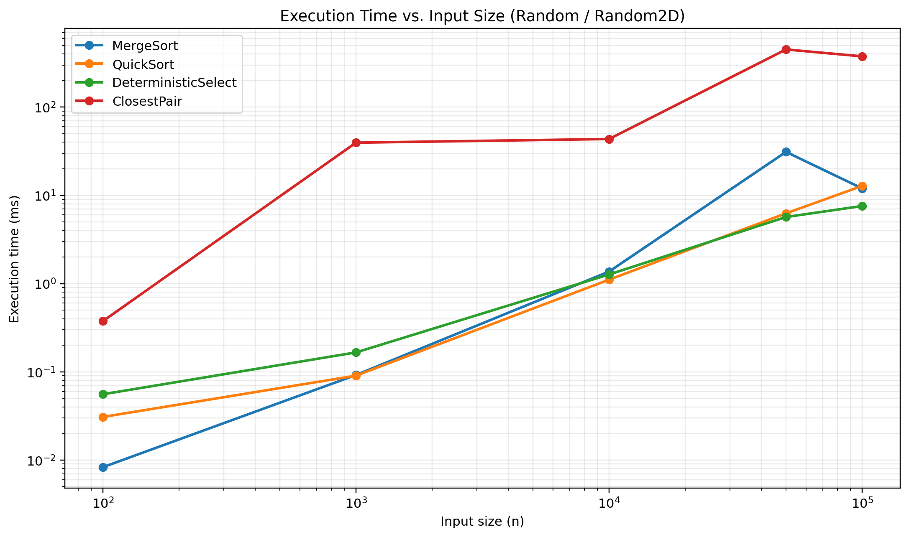
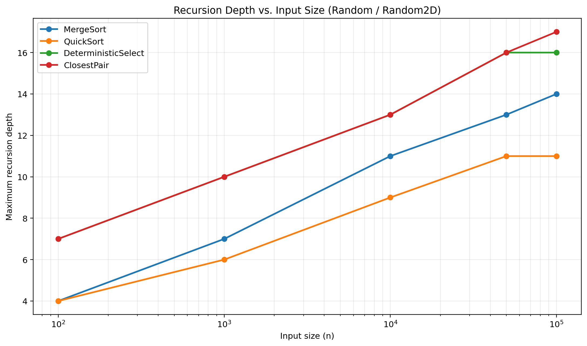

# Assignment 1: Divide-and-Conquer Algorithm Analysis

## A. Project Overview

### Purpose
This project implements, measures, tests, and analyzes four classic divide-and-conquer algorithms. The implementation records execution time, maximum recursion depth, comparisons, and swaps/allocations, then saves benchmark results to `results/results.csv`.

### Implemented Algorithms
1. **MergeSort** — linear merge, reusable auxiliary buffer, and insertion-sort cutoff for small subarrays.
2. **QuickSort** — randomized pivot, in-place 3-way partitioning, and smaller-first recursion with iteration over the larger partition.
3. **Deterministic Select / Median-of-Medians** — groups of five, deterministic pivot selection, and 3-way partitioning for duplicate-heavy inputs.
4. **Closest Pair of Points** — 2D divide-and-conquer with x-splitting, y-order strip checking, and brute-force base cases.

## B. Algorithm Analysis

### 1. MergeSort

**How it works:** The array is recursively split into two halves, each half is sorted, and the sorted halves are merged using a reusable auxiliary buffer. Subarrays of size at most 16 elements use insertion sort.

**Complexity:** Time `Θ(n log n)` in all cases. Auxiliary space `Θ(n)`.

**Recurrence:** `T(n) = 2T(n/2) + Θ(n)`, giving `Θ(n log n)` by the Master Theorem.

### 2. QuickSort

**How it works:** A randomized pivot value is selected and the array is partitioned into elements smaller than, equal to, and greater than the pivot. The smaller side is processed recursively while the larger side is handled by the loop.

**Complexity:** Expected time `Θ(n log n)`; worst-case time `O(n²)` for unfavorable pivot choices. With smaller-first recursion, auxiliary recursion-stack space is `O(log n)`.

**Recurrence:** `T(n) = T(k) + T(n-k-1) + Θ(n)`; randomized pivots give expected `Θ(n log n)`.

### 3. Deterministic Select (Median-of-Medians)

**How it works:** Elements are divided into groups of five. Each group is sorted to obtain its median; the median of these medians is then used as a deterministic pivot. A 3-way partition places values below, equal to, and above the pivot into separate regions.

**Complexity:** Worst-case time `Θ(n)` and recursion-stack space `O(log n)` for the main selection recursion. The 3-way partition is important for duplicate-heavy inputs because all values equal to the pivot are discarded from further recursion.

**Recurrence:** `T(n) ≤ T(n/5) + T(7n/10) + Θ(n)`, which solves to `Θ(n)`.

### 4. Closest Pair of Points

**How it works:** Points are sorted by x and y. The x-sorted list is split into two balanced halves. Each half is solved recursively, then a vertical strip around the dividing line is checked in y-order.

**Complexity:** Time `Θ(n log n)` for the divide-and-conquer stage and `O(n)` auxiliary space per recursive level / `O(n log n)` cumulative allocation in this straightforward array-slicing implementation.

**Recurrence:** `T(n) = 2T(n/2) + Θ(n)`, giving `Θ(n log n)`.

## C. Experimental Results

The benchmark program tests the required sizes:

`100, 1,000, 10,000, 50,000, 100,000`

Input types:

- Random
- Sorted
- Reverse-Sorted
- Duplicate-Heavy
- Random2D for Closest Pair

Metrics saved for every run:

- Execution time in milliseconds
- Maximum recursion depth
- Comparisons
- Swaps/allocations

The CSV uses a dot as the decimal separator so that every row remains a valid comma-separated record.

### Plot 1 — Time vs. n



### Plot 2 — Recursion Depth vs. n



### Results tables

The complete results are stored in `results/results.csv`. The benchmark was run after a small JVM warm-up. Exact timings vary with hardware and system load.

**Random / Random2D inputs**

| n | MergeSort ms | QuickSort ms | Select ms | Closest Pair ms |
|---:|---:|---:|---:|---:|
| 100 | 0.0083 | 0.0308 | 0.0557 | 0.3757 |
| 1,000 | 0.0921 | 0.0905 | 0.1660 | 39.6160 |
| 10,000 | 1.3693 | 1.1085 | 1.2692 | 43.5677 |
| 50,000 | 31.1297 | 6.2589 | 5.6881 | 451.3186 |
| 100,000 | 11.9958 | 12.7996 | 7.5799 | 376.9062 |

**Duplicate-heavy inputs**

| n | MergeSort ms | QuickSort ms | Select ms |
|---:|---:|---:|---:|
| 100 | 0.0064 | 0.0032 | 0.0094 |
| 1,000 | 0.0782 | 0.0222 | 0.1426 |
| 10,000 | 4.8072 | 0.1832 | 0.7116 |
| 50,000 | 9.8446 | 0.9381 | 2.7935 |
| 100,000 | 6.0066 | 1.8835 | 3.2986 |

The recursion-depth and operation-count columns for every input type are available in the CSV. The plots use the Random/Random2D series to make the growth trends directly comparable.

**Maximum recursion depth — Random / Random2D**

| n | MergeSort | QuickSort | Select | Closest Pair |
|---:|---:|---:|---:|---:|
| 100 | 4 | 4 | 7 | 7 |
| 1,000 | 7 | 6 | 10 | 10 |
| 10,000 | 11 | 9 | 13 | 13 |
| 50,000 | 13 | 11 | 16 | 16 |
| 100,000 | 14 | 11 | 16 | 17 |

**Maximum recursion depth — Duplicate-Heavy**

| n | MergeSort | QuickSort | Select |
|---:|---:|---:|---:|
| 100 | 4 | 2 | 4 |
| 1,000 | 7 | 3 | 6 |
| 10,000 | 11 | 3 | 7 |
| 50,000 | 13 | 2 | 8 |
| 100,000 | 14 | 2 | 9 |

> Run `Main` to regenerate `results/results.csv` on the target machine. Exact timings depend on JVM warm-up, CPU, memory pressure, and operating-system load.

## D. Discussion

### Do the results match theoretical complexity?
The benchmark should be interpreted together with the asymptotic analysis rather than as an exact proof of complexity. MergeSort and Closest Pair should show near `n log n` growth, while Deterministic Select is designed for worst-case linear-time selection. QuickSort is expected to show `n log n` behavior on typical inputs, with input structure and pivot choices affecting measured time.

### How does input structure affect performance?
MergeSort is comparatively insensitive to whether the input is random, sorted, reverse-sorted, or duplicate-heavy because its merge structure is fixed. QuickSort is more sensitive to duplicates and pivot distribution; the implementation therefore uses randomized pivots and 3-way partitioning. Deterministic Select also uses 3-way partitioning so large groups of equal values do not force repeated recursion.

### Why does smaller-first recursion help QuickSort?
After partitioning, the smaller side is processed recursively and the larger side is processed by iteration. This limits the number of simultaneously active recursive calls and keeps recursion-stack usage logarithmic.

### Why does Median-of-Medians guarantee `O(n)`?
The median-of-medians construction guarantees a pivot that discards a fixed fraction of the elements at every selection level. The recurrence `T(n) ≤ T(n/5) + T(7n/10) + Θ(n)` therefore resolves to linear time. The 3-way partition additionally handles equal keys without repeatedly selecting from a large equal-valued region.

### Why is divide-and-conquer Closest Pair faster than `O(n²)` for large inputs?
The algorithm recursively solves two halves and only examines a restricted vertical strip near the dividing line. Because the strip is processed in y-order, only a bounded number of following points need to be considered for each point, giving `Θ(n log n)` overall time.

### Practical factors
Measured times are affected by JVM JIT warm-up, garbage collection, CPU cache behavior, array allocations, operating-system scheduling, and the resolution/noise of short timing intervals. The benchmark performs a small warm-up before collecting the displayed measurements and writes times with a fixed decimal format.

## E. Reflection

Implementing this assignment provided practical experience with recursive divide-and-conquer algorithms and showed how theoretical complexity appears in real measurements. The project also demonstrated why implementation details matter: randomized pivots, insertion-sort cutoffs, reusable buffers, and 3-way partitioning can substantially change practical behavior while preserving the intended asymptotic design.

The main implementation challenges were maintaining correct indices across recursive partitions, tracking recursion depth and operation counts without corrupting algorithm state, and handling duplicate-heavy inputs. The correctness tests compare sorting with `Arrays.sort()`, selection with the sorted reference value, and Closest Pair with an `O(n²)` brute-force implementation on small datasets.

## F. Screenshots

The repository should contain readable screenshots of:

- Program output
- Correctness-test output
- CSV/results and plots

Files are stored under `docs/screenshots/`.

## GitHub Workflow

The intended development history is:

```text
init: project structure and tests
feat(mergesort): implement merge sort
feat(quicksort): implement randomized quicksort
feat(select): implement median-of-medians
feat(closest): implement closest pair
feat(metrics): add performance measurements
feat(testing): add correctness tests
docs(report): add analysis and plots
fix: handle edge cases
release: v1.0
```

Final tag:

```bash
git tag -a v1.0 -m "Release v1.0"
```
